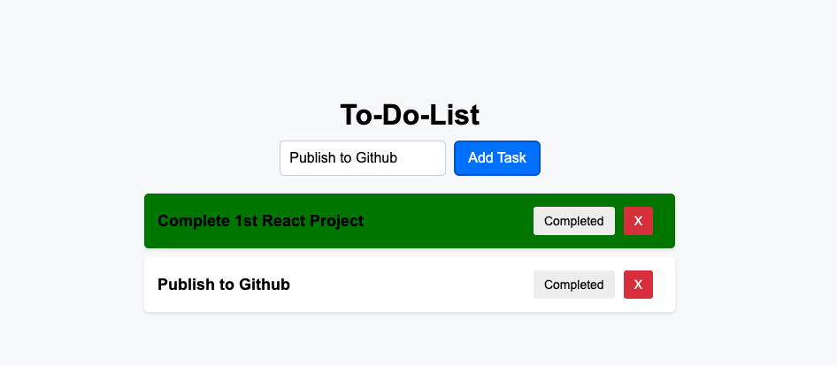

# React To-Do List

A simple to-do list web application built using React.js.



## Table of Contents

- [Introduction](#introduction)
- [Features](#features)
- [Installation](#installation)
- [Usage](#usage)
- [Technologies Used](#technologies-used)

## Introduction

This project is a basic to-do list application created with React.js. It allows users to add, delete, and mark tasks as completed. The goal of this project is to provide a simple yet functional example of a React.js application. This is my first React.js project and I drew my inspriration from PedroTeach's ReactJS Course available on YouTube.

## Features

- Add new tasks to the to-do list.
- Delete tasks from the list.
- Mark tasks as completed.
- Responsive design for various screen sizes.

## Installation

To run this project locally, follow these steps:

1. Clone the repository:

   ```bash
   git clone https://github.com/JacobJ215/to-do-list.git
   ```

2. Navigate to the project directory:

   ```bash
   cd react-to-do-list
   ```

3. Install dependencies:

   ```bash
   npm install
   ```

4. Start the development server:

   ```bash
   npm start
   ```

5. Open your web browser and visit http://localhost:3000 to view the application.

## Usage

Once the application is running, you can:

- Enter a task in the input field and click "Add Task" to add it to the list.
- Click the "X" button next to a task to delete it.
- Click the "Completed" button to mark a task as completed.

## Technologies Used

- React.js
- JavaScript (ES6+)
- HTML5
- CSS3
